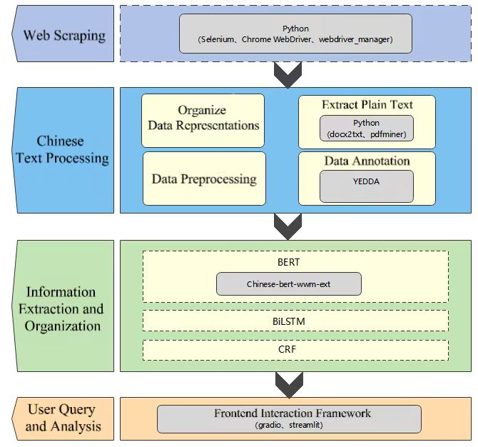

# Chinese Resume Text Information Extraction Model / 简历文本信息自动获取系统 

The Chinese Resume Text Information Extraction System is an efficient automated tool designed to quickly and accurately extract key information from a large number of resume documents. The system consists of four core modules: web crawler, Chinese text processing, information extraction, and user query and analysis. The system architecture is shown in the figure below: 

Note: Due to the large file size of the pre-trained BERT Chinese model and the final BERT-BiLSTM-CRF model, they have not been uploaded to this GitHub repository. The pre-trained BERT Chinese model can be obtained from the Hugging Face website, and the BERT-BiLSTM-CRF model can be generated by running the main.py code in the BERT-BiLSTM-CRF folder.

中文翻译：

中文简历文本信息提取系统是一个高效的自动化工具，旨在快速、准确地从大量简历文档中提取关键信息。该系统由四个核心模块组成：网络爬虫、中文文本处理、信息提取和用户查询与分析。系统架构如下图所示： 

注：由于预训练的 BERT 中文模型和最终的 BERT-BiLSTM-CRF 模型文件较大，因此没有上传到此 GitHub 仓库。预训练的 BERT 中文模型可从 Hugging Face 网站获取，BERT-BiLSTM-CRF 模型可通过运行 BERT-BiLSTM-CRF 文件夹中的 main.py 代码生成。

