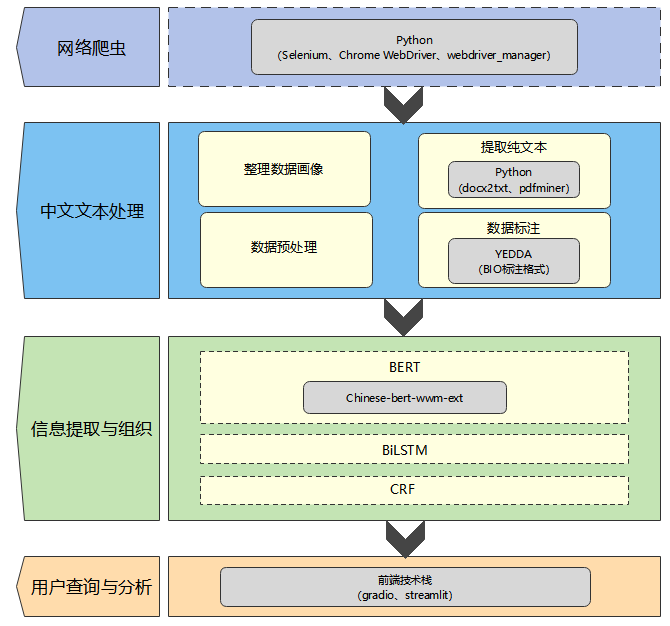

# 简历文本信息自动获取系统 Chinese Resume Text Information Extraction Model

The Chinese Resume Text Information Extraction System is an efficient automated tool designed to quickly and accurately extract key information from a large number of resume documents. The system consists of four core modules: web crawler, Chinese text processing, information extraction, and user query and analysis. The system architecture is shown in the figure below: 

Note: Due to the large file size of the pre-trained BERT Chinese model and the final BERT-BiLSTM-CRF model, they have not been uploaded to this GitHub repository. The pre-trained BERT Chinese model can be obtained from the Hugging Face website, and the BERT-BiLSTM-CRF model can be generated by running the main.py code in the BERT-BiLSTM-CRF folder.
